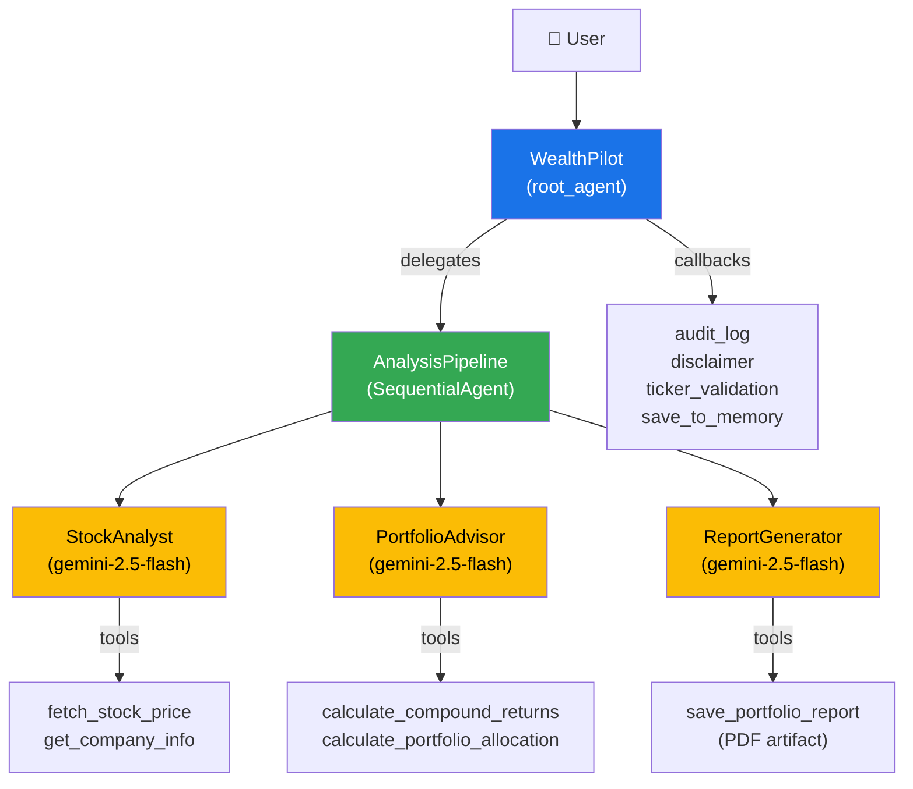

# Building Multi-Agent Systems with Google ADK

> Course companion repo — build, run, and deploy production multi-agent systems with the [Google Agent Development Kit (ADK)](https://google.github.io/adk-docs/).

## What You'll Learn

- **Multi-agent orchestration** — Deterministic and Non-deterministic agents using `SequentialAgent`, `LlmAgent`, `LoopAgent`, `ParallelAgent` sub-agent delegation
- **Custom tools** — `FunctionTool` with live APIs (yFinance), session state, and artifacts
- **Callbacks & guardrails** — before/after agent, model, and tool callbacks for validation and audit
- **Session state & memory** — persist user preferences across turns, recall past conversations
- **Artifacts** — generate and download PDF reports from agent workflows
- **Thinking** — enable `ThinkingConfig` for step-by-step reasoning
- **Deployment** — Cloud Run, Agent Engine, Docker, Vercel

## Repo Structure

```
multi-agent-systems/
├── adk_kitchen_demo/       # Beginner demo — SequentialAgent kitchen metaphor
│   └── agent.py            # Host → Expediter → GrillChef/SaladChef/Plater
│
├── wealth_pilot/           # Production agent — AI Wealth Advisor
│   ├── agent.py            # Root agent with sub-agent pipeline
│   ├── tools/              # Stock data, calculations, PDF reports
│   ├── callbacks/          # Guardrails, audit logging, memory
│   ├── main.py             # FastAPI production server
│   ├── runner_demo.py      # Programmatic Runner demo
│   └── Dockerfile          # Container for Cloud Run / Docker
│
├── wealth_pilot_ui/        # Custom frontend (Next.js)
│   └── app/page.tsx        # SSE streaming chat with agent progress
│
├── docs/lectures/          # Lecture reference docs
│   ├── local_deployment.md
│   ├── runner.md
│   ├── session_state_and_memory.md
│   ├── callbacks.md
│   ├── artifacts.md
│   ├── code_execution.md
│   ├── cloud_run_deployment.md
│   └── agent_engine_deployment.md
│
├── prerequisites/          # Setup guides (Python, GCP, etc.)
└── docker-compose.yml      # Full stack: backend + frontend
```

## Architecture



## Prerequisites

| Tool | Version | Install |
|---|---|---|
| Python | 3.12+ | [python.org](https://www.python.org/downloads/) |
| uv | latest | `curl -LsSf https://astral.sh/uv/install.sh \| sh` |
| Node.js | LTS (22+) | [nodejs.org](https://nodejs.org/) |
| Google API Key | — | [Google AI Studio](https://aistudio.google.com/apikey) |

> See [`prerequisites/`](prerequisites/) for detailed setup guides including GCP configuration.

## Quickstart

```bash
# 1. Clone the repo
git clone https://github.com/AiWithGeorge/multi-agent-systems.git
cd multi-agent-systems

# 2. Set up the Kitchen Demo (beginner)
cd adk_kitchen_demo
uv sync
echo "GOOGLE_API_KEY=your-api-key-here" > .env
adk web .
# Open http://localhost:8000 → select "adk_kitchen_demo"

# 3. Set up WealthPilot (production)
cd ../wealth_pilot
uv sync
echo "GOOGLE_API_KEY=your-api-key-here" > .env
adk web .
# Open http://localhost:8000 → select "wealth_pilot"
```

## Running the Agents

All commands are run from the **repo root** (`multi-agent-systems/`).

### ADK Dev UI (Browser)

```bash
# Kitchen Demo
adk web adk_kitchen_demo

# WealthPilot
adk web wealth_pilot
```

Opens an interactive browser UI at `http://localhost:8000` with chat, events inspector, and artifact viewer.

### ADK Terminal REPL

```bash
# Kitchen Demo
adk run adk_kitchen_demo

# WealthPilot
adk run wealth_pilot
```

Interactive terminal chat — type messages and see agent responses inline.

### Python Runner (Programmatic)

```bash
cd wealth_pilot
uv run python -m wealth_pilot.runner_demo
```

Demonstrates the `Runner` class with full service configuration (session, memory, artifacts).

### FastAPI Production Server

```bash
cd wealth_pilot
uv run python main.py
# Server at http://localhost:8080
```

Production-ready FastAPI server using `get_fast_api_app()` with custom endpoints for artifact downloads.

### Docker Compose (Full Stack)

```bash
# From repo root — starts backend + frontend
docker compose up --build

# Backend:  http://localhost:8080
# Frontend: http://localhost:3000
```

### Custom UI (Next.js)

```bash
cd wealth_pilot_ui
npm install
NEXT_PUBLIC_API_URL=http://localhost:8080 npm run dev
# Open http://localhost:3000
```

> **Note:** The custom UI connects to the FastAPI backend. Start the backend first (either via `python main.py` or `docker compose`).

## Deployment

| Target | Method | Docs |
|---|---|---|
| **Cloud Run** | `adk deploy cloud_run` | [`docs/lectures/cloud_run_deployment.md`](docs/lectures/cloud_run_deployment.md) |
| **Agent Engine** | `adk deploy agent_engine` | [`docs/lectures/agent_engine_deployment.md`](docs/lectures/agent_engine_deployment.md) |
| **Vercel** (UI) | `vercel --prod` | See [video doc](docs/lectures/cloud_run_deployment.md) |
| **Docker** | `docker compose up` | [`docker-compose.yml`](docker-compose.yml) |

### Quick Deploy to Cloud Run

```bash
export GOOGLE_CLOUD_PROJECT="your-project-id"
export GOOGLE_CLOUD_LOCATION="us-central1"

adk deploy cloud_run \
  --project=$GOOGLE_CLOUD_PROJECT \
  --region=$GOOGLE_CLOUD_LOCATION \
  --service_name="wealth-pilot-service" \
  --allow_origins="*" \
  wealth_pilot \
  -- --set-secrets="GOOGLE_API_KEY=google-api-key:latest" \
     --set-env-vars="GOOGLE_GENAI_USE_VERTEXAI=0"
```

## Projects

### 🍔 [ADK Kitchen Demo](adk_kitchen_demo/)

A beginner-friendly demo using a restaurant kitchen metaphor. Teaches `SequentialAgent` orchestration where a Host takes your burger order and routes it through a GrillChef → SaladChef → PlaterAgent pipeline.

### 💰 [WealthPilot](wealth_pilot/)

A production multi-agent AI Wealth Advisor. Demonstrates the full ADK feature set: custom tools with live APIs, callbacks for guardrails, session state, cross-session memory, PDF artifact generation, and thinking mode.

### 🖥️ [WealthPilot UI](wealth_pilot_ui/)

A custom Next.js frontend that connects to the WealthPilot backend via SSE. Features real-time streaming responses, agent progress indicators, markdown rendering, and PDF artifact downloads.

## Course Lectures

| # | Topic | Doc |
|---|---|---|
| 1 | Local Deployment (`adk web`, `adk run`, FastAPI) | [`local_deployment.md`](docs/lectures/local_deployment.md) |
| 2 | The Runner (programmatic execution engine) | [`runner.md`](docs/lectures/runner.md) |
| 3 | Session State & Memory | [`session_state_and_memory.md`](docs/lectures/session_state_and_memory.md) |
| 4 | Callbacks & Guardrails | [`callbacks.md`](docs/lectures/callbacks.md) |
| 5 | Artifacts (PDF generation) | [`artifacts.md`](docs/lectures/artifacts.md) |
| 6 | Code Execution | [`code_execution.md`](docs/lectures/code_execution.md) |
| 7 | Cloud Run Deployment | [`cloud_run_deployment.md`](docs/lectures/cloud_run_deployment.md) |
| 8 | Agent Engine Deployment | [`agent_engine_deployment.md`](docs/lectures/agent_engine_deployment.md) |

## Troubleshooting

| Issue | Solution |
|---|---|
| `GOOGLE_API_KEY` not found | Create a `.env` file in the agent directory: `echo "GOOGLE_API_KEY=..." > .env` |
| `ModuleNotFoundError` | Run `uv sync` in the agent directory to install dependencies |
| Cloud Run `PERMISSION_DENIED` | Add `GOOGLE_GENAI_USE_VERTEXAI=0` env var (prevents auto-switch to Vertex AI) |
| Cloud Build empty logs | Grant `roles/logging.logWriter` to the Compute Engine service account |
| Agent Engine payload too large | Create `.ae_ignore` file to exclude `.venv/` (see `wealth_pilot/.ae_ignore`) |
| CORS errors from custom UI | Add `--allow_origins="*"` to the `adk deploy cloud_run` command |

## License

This project is licensed under the Apache License 2.0 — see [LICENSE](LICENSE) for details.

---

**Built with [Google Agent Development Kit (ADK)](https://google.github.io/adk-docs/)** · Course by [George Alonge](https://alonge.dev)
