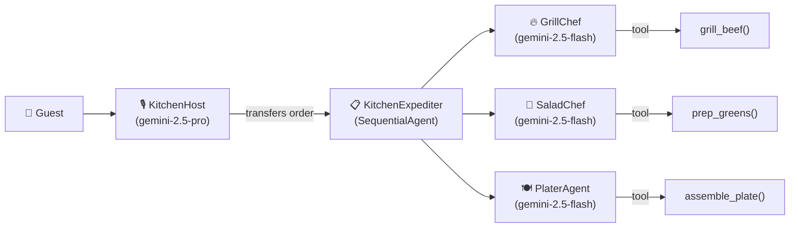

# 🍔 ADK Kitchen Demo

A beginner-friendly multi-agent demo using a restaurant kitchen metaphor. This is your first introduction to how agents work together in Google ADK.

## What This Teaches

- **`LlmAgent`** — Individual agents with specific roles and tools
- **`SequentialAgent`** — Pipeline orchestration (step A → step B → step C)
- **Multi-model routing** — Different models for different agents
- **Mock tools** — Simple `FunctionTool` pattern without external APIs

## The Kitchen Brigade



| Agent | Role | Model | Tool |
|---|---|---|---|
| **KitchenHost** | Greets guests, takes orders | `gemini-2.5-pro` | — |
| **KitchenExpediter** | Runs the pipeline in order | `SequentialAgent` | — |
| **GrillChef** | Cooks the beef patty | `gemini-2.5-flash` | `grill_beef()` |
| **SaladChef** | Preps the greens | `gemini-2.5-flash` | `prep_greens()` |
| **PlaterAgent** | Assembles and presents | `gemini-2.5-flash` | `assemble_plate()` |

## Setup

```bash
cd adk_kitchen_demo
uv sync
echo "GOOGLE_API_KEY=your-api-key-here" > .env
```

## Run

```bash
# Browser UI
adk web .

# Terminal REPL
adk run .
```

Or from the **repo root**:

```bash
adk web adk_kitchen_demo
adk run adk_kitchen_demo
```

## Example Conversation

```
You: I'd like a burger please!

KitchenHost: Welcome to the ADK Kitchen Brigade! 🍔
I'd love to craft the perfect burger for you. Two quick questions:
1. How would you like your beef cooked? (rare, medium-rare, medium, medium-well, well-done)
2. What style greens? (classic, caesar, garden)

You: Medium-rare with caesar greens

KitchenHost: Great choice! Sending your order to the kitchen...

[GrillChef] → grill_beef("medium-rare") ✅
[SaladChef] → prep_greens("caesar") ✅
[PlaterAgent] → assemble_plate(...) ✅

PlaterAgent: 🍔 Your order is ready!
━━━━━━━━━━━━━━━━━━━━━━
🔥 THE GRILL
  Angus Beef Patty — Cooked medium-rare, 1/2 lb
🥗 THE GREENS
  Caesar Style — Crisp Lettuce, Heirloom Tomato, Red Onion
━━━━━━━━━━━━━━━━━━━━━━
Assembled by the ADK Kitchen Brigade!
Enjoy your meal! 🎉
```

## Key Concepts

### SequentialAgent
The `KitchenExpediter` ensures agents run in order. Unlike `LlmAgent` (which uses an LLM to decide what to do), `SequentialAgent` is a fixed pipeline — no LLM calls, just step-by-step execution.

### Sub-Agent Delegation
The `KitchenHost` (root agent) delegates to the `KitchenExpediter` via `sub_agents=[kitchen_expediter]`. ADK handles the transfer automatically when the host decides the order is ready.

### Mock Tools
The tools (`grill_beef`, `prep_greens`, `assemble_plate`) return hardcoded JSON. This pattern lets you prototype agent behavior before connecting real APIs.
