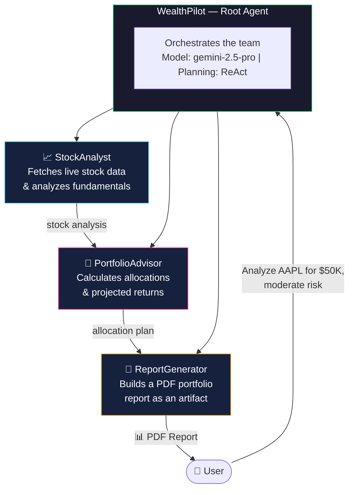
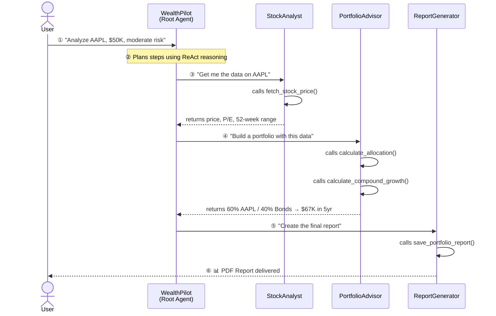
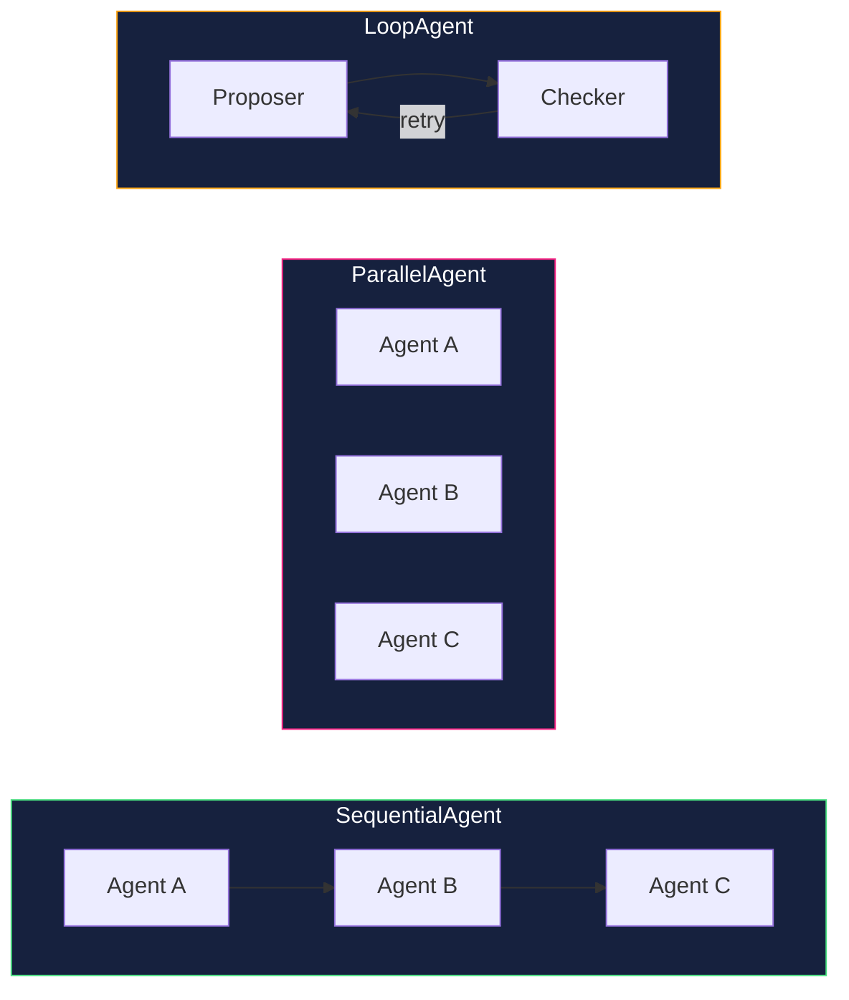

# WealthPilot — Architecture

> **WealthPilot** is an AI Wealth Advisor built with Google's Agent Development Kit (ADK).
> It analyzes stocks, builds portfolios, optimizes for risk, and generates PDF reports —
> all powered by a team of specialized AI agents working together.

---

## What We're Building



---

## How a Request Flows



---

## ADK Components Used

Each row maps an ADK concept to how WealthPilot uses it.

| ADK Concept | What It Does | WealthPilot Usage |
|---|---|---|
| **LlmAgent** | AI agent with a model + instructions | WealthPilot, StockAnalyst, PortfolioAdvisor, ReportGenerator |
| **SequentialAgent** | Runs agents in order | AnalysisPipeline (Analyst → Advisor → Report) |
| **ParallelAgent** | Runs agents simultaneously | Analyze multiple stocks at once |
| **LoopAgent** | Repeats until a condition is met | Optimize allocation until risk tolerance is satisfied |
| **FunctionTool** | Python function an agent can call | `fetch_stock_price`, `calculate_compound_growth`, `save_portfolio_report` |
| **AgentTool** | Use one agent as a tool for another | StockAnalyst available as a tool to PortfolioAdvisor |
| **Callbacks** | Hooks that run before/after agent/model/tool | Ticker validation, financial disclaimers, audit logging |
| **Session & State** | Conversation tracking + key-value storage | Store risk tolerance, budget, preferences per conversation |
| **Memory** | Cross-session recall | Remember user preferences across conversations |
| **Artifacts** | File storage for generated outputs | Save PDF portfolio reports |
| **Planning (ReAct)** | Multi-step reasoning and tool use | Root agent decomposes complex requests into steps |

---

## Agent Types at a Glance



- **Sequential** — Agents run one after another. Output of A feeds into B.
- **Parallel** — All agents run at the same time. Results are collected together.
- **Loop** — Agents repeat in a cycle until a condition is satisfied.

---

## Lecture Guide (Section 2)

| Lecture | Topic | What We'll Cover |
|-------|-------|-----------------|
| 2.1 | Section Intro | Architecture overview (this doc) |
| 2.2 | Agents & Models | Root agent + 3 sub-agents |
| 2.3 | Tools | `stock_tools.py` — live stock data via yfinance |
| 2.4 | Callbacks | Ticker validation, disclaimers, audit log |
| 2.5 | Session, State & Events | User preferences in state |
| 2.6 | Memory | Cross-session recall |
| 2.7 | Code Execution | `calc_tools.py` — compound returns, allocations |
| 2.8 | Artifacts | `report_tools.py` — PDF portfolio report |
| 2.9 | Planning | ReAct planner for multi-step requests |
| 2.10 | Parallel & Loop Agents | Multi-stock fetch + risk optimization loop |
| 2.11 | Runner & AgentTool | Programmatic runner with all services |
| 2.12 | Putting It Together | Final polish, E2E demo |

---

## Project Structure

```
wealth_pilot/
├── agent.py                  # All agents + orchestration
├── tools/
│   ├── stock_tools.py        # fetch_stock_price, get_company_info
│   ├── calc_tools.py         # compound returns, allocation math
│   └── report_tools.py       # save_portfolio_report (PDF artifact)
├── callbacks/
│   └── guardrails.py         # ticker validation, disclaimers, audit
├── docs/                     # Per-video guides + extensions
├── main.py                   # FastAPI production server
├── .env                      # GOOGLE_API_KEY
└── pyproject.toml            # Dependencies
```
