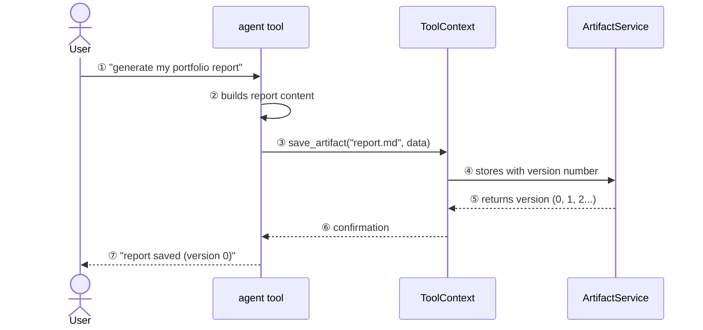
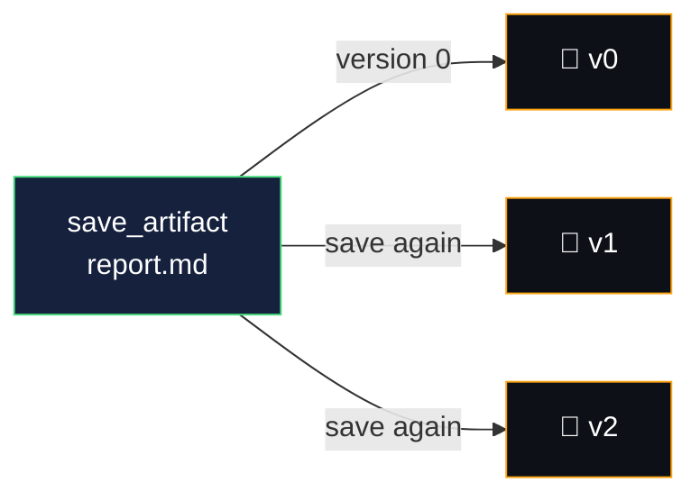

# artifacts — files your agent produces

> artifacts let your agent **create, save, and version files** — reports, CSVs, images,
> PDFs — as structured binary data that persists beyond the conversation.

think of artifacts like a filing cabinet for your agent. each time the agent generates
a report, it files it under a name. save the same name again? it creates a new version,
not an overwrite.

---

## how artifacts fit into the agent flow



---

## artifacts vs state vs memory

| | state | memory | artifacts |
|---|---|---|---|
| **what it stores** | key-value pairs | conversation summaries | files (binary data) |
| **scope** | within session | across sessions | session or user |
| **size** | small (strings, numbers) | medium (text) | large (PDFs, images, CSVs) |
| **versioned** | no (overwrite) | no | yes (auto-incrementing) |
| **access via** | `ctx.state["key"]` | `LoadMemoryTool` | `ctx.save_artifact()` / `ctx.load_artifact()` |
| **best for** | preferences, flags | recall past conversations | reports, exports, uploads |

---

## core concepts

### artifact data

artifacts are represented as `google.genai.types.Part` objects:

```python
from google.genai import types

# text artifact (markdown report)
report = types.Part.from_text(text="# my report\n...")

# binary artifact (image)
image = types.Part.from_bytes(data=image_bytes, mime_type="image/png")
```

### versioning

every `save_artifact()` call with the same filename auto-increments the version:



- `load_artifact("report.md")` → returns latest version
- `load_artifact("report.md", version=0)` → returns specific version

### namespacing — session vs user scope

| filename | scope | accessible from |
|---|---|---|
| `"report.md"` | session | only the current session |
| `"user:profile.png"` | user | any session for that user |

the `user:` prefix makes an artifact persist across sessions — useful for
profile images, saved settings, or any user-level data.

---

## API methods

all artifact methods are **async** and accessed via `ToolContext` or `CallbackContext`:

| method | what it does |
|---|---|
| `await ctx.save_artifact(filename, artifact)` | saves a `types.Part`, returns version number |
| `await ctx.load_artifact(filename, version=None)` | loads latest (or specific) version, returns `Part` or `None` |
| `await ctx.list_artifacts()` | returns list of filenames in current session |

> ⚠️ `save_artifact()` is **async** — your tool function must be `async def` and use `await`.
> without this, you'll get `Object of type coroutine is not JSON serializable`.

---

## artifact service backends

| service | storage | best for |
|---|---|---|
| `InMemoryArtifactService` | RAM (lost on restart) | development, testing |
| `GcsArtifactService` | Google Cloud Storage | production |

> 💡 `adk web` automatically uses `InMemoryArtifactService` — no setup needed for local dev.

---

## what we'll build in WealthPilot

| tool | what it does |
|---|---|
| `save_portfolio_report` | saves portfolio analysis reports as versioned markdown artifacts using `tool_context.save_artifact()` |

the report is viewable in the **artifacts panel** of the ADK web UI after generation.

---

## docs & references

- [ADK Artifacts documentation](https://google.github.io/adk-docs/artifacts/)
