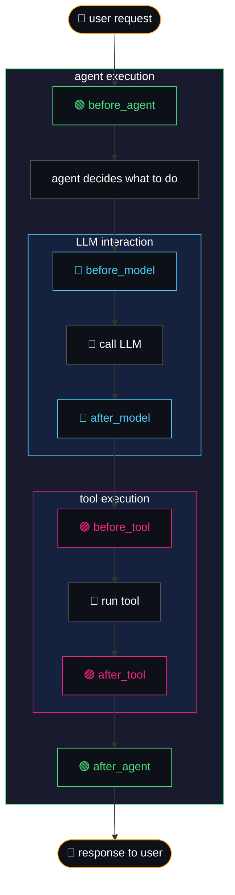
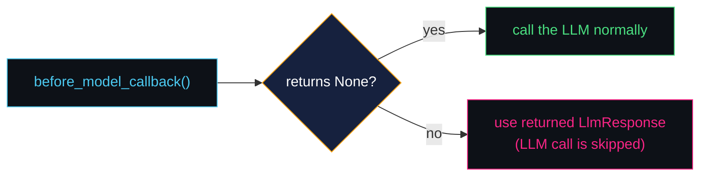

# callbacks — hooks into the agent execution flow

> callbacks let you observe, customize, and control what happens at key moments
> during an agent's execution — without modifying any ADK framework code.

think of them as **airport security checkpoints**: your luggage (data) passes through
scanners (callbacks) at specific points. each checkpoint can inspect, modify, or even
reject items before they continue on their journey.

---

## where callbacks hook in

the diagram below shows every point in the agent execution cycle where you can
attach a callback. there are **6 hooks** organized into **3 pairs**:

---

## the three callback categories

| category | callbacks | what they wrap | available on |
|---|---|---|---|
| **agent lifecycle** | `before_agent` / `after_agent` | the agent's entire run | all agent types |
| **LLM interaction** | `before_model` / `after_model` | each call to the LLM | `LlmAgent` only |
| **tool execution** | `before_tool` / `after_tool` | each tool invocation | `LlmAgent` only |

---

## how callbacks control the flow

this is the most powerful part — **the return value decides what happens next**.

### the two paths

| return value | what happens |
|---|---|
| `None` | ✅ proceed normally — the callback just observed or modified in-place |
| **an object** | ⛔ skip/override the step — the returned object replaces the real result |

### decision flow for `before_model`

### return types for each callback

| callback | return to **skip/override** | use case |
|---|---|---|
| `before_agent` | `types.Content` | skip the agent's logic entirely |
| `after_agent` | `types.Content` | replace the agent's output |
| `before_model` | `LlmResponse` | skip the LLM call (guardrails, cache) |
| `after_model` | `LlmResponse` | modify/replace the LLM response |
| `before_tool` | `dict` | skip tool execution (validation, mocks) |
| `after_tool` | `dict` | modify/replace tool results |

---

## what we'll build in WealthPilot

we'll implement three callbacks in `callbacks/guardrails.py`:

| callback | hook | what it does |
|---|---|---|
| `validate_ticker` | `before_tool` | rejects invalid stock ticker symbols before they reach yfinance |
| `add_disclaimer` | `after_agent` | appends "this is not financial advice" to every agent response |
| `audit_log` | `before_agent` | logs every agent invocation with a timestamp and agent name |

---

## when to use callbacks

| ✅ good fit | ❌ use something else |
|---|---|
| input/output validation | complex multi-step business logic (use agents) |
| logging and audit trails | persistent data storage (use session state) |
| adding disclaimers or safety checks | security policies (use ADK plugins) |
| caching LLM responses | cross-agent communication (use state/memory) |
| blocking disallowed operations | |
| modifying prompts before they hit the LLM | |

---

## quick-reference cheat sheet

| hook | fires | signature (Python) | skip by returning |
|---|---|---|---|
| `before_agent` | before agent runs | `(CallbackContext) → Content \| None` | `types.Content` |
| `after_agent` | after agent finishes | `(CallbackContext) → Content \| None` | `types.Content` |
| `before_model` | before LLM call | `(CallbackContext, LlmRequest) → LlmResponse \| None` | `LlmResponse` |
| `after_model` | after LLM response | `(CallbackContext, LlmResponse) → LlmResponse \| None` | `LlmResponse` |
| `before_tool` | before tool runs | `(CallbackContext, ToolContext) → dict \| None` | `dict` |
| `after_tool` | after tool returns | `(CallbackContext, ToolContext) → dict \| None` | `dict` |
