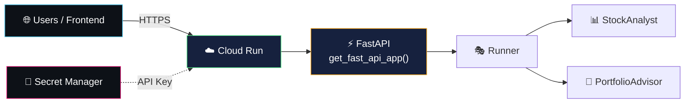

# cloud run deployment — serverless containers for your agents

> Cloud Run is a serverless container platform on Google Cloud. deploy your ADK agent
> as a containerized FastAPI app that auto-scales from zero to thousands of requests.

---

## why Cloud Run

| feature | what it means |
|---|---|
| **serverless** | no servers to manage — Google handles infrastructure |
| **auto-scaling** | scales from 0 to N instances based on traffic |
| **pay-per-use** | only pay when your agent is processing requests |
| **container-based** | full control over runtime, dependencies, and config |
| **HTTPS** | automatic TLS certificates and custom domains |

---

## two deployment methods

| method | effort | control | best for |
|---|---|---|---|
| `adk deploy cloud_run` | ⭐ low (one command) | limited | quick deployment |
| `gcloud` CLI + Dockerfile | ⭐⭐ medium | full control | custom servers, production |

---

## method 1: `adk deploy cloud_run`

the fastest way — one command handles everything:

```bash
# set variables
export GOOGLE_CLOUD_PROJECT="my-wealth-pilot"
export GOOGLE_CLOUD_LOCATION="us-central1"

# deploy (with secret passthrough via --)
adk deploy cloud_run \
  --project=$GOOGLE_CLOUD_PROJECT \
  --region=$GOOGLE_CLOUD_LOCATION \
  --service_name="wealth-pilot-service" \
  --allow_origins="*" \
  wealth_pilot \
  -- --set-secrets="GOOGLE_API_KEY=google-api-key:latest" \
     --set-env-vars="GOOGLE_GENAI_USE_VERTEXAI=0"
```

### key flags

| flag | what it does |
|---|---|
| `--project` | GCP project ID |
| `--region` | deployment region (e.g. `us-central1`) |
| `--service_name` | name of your Cloud Run service |
| `--with_ui` | include the Dev UI (default: API only) |
| `--allow_unauthenticated` | allow public access (no auth required) |

### passing gcloud flags with `--`

use the double-dash separator (`--`) after the ADK arguments to pass flags directly
to the underlying `gcloud run deploy` command:

```bash
# syntax
adk deploy cloud_run [ADK_FLAGS] agent_path -- [GCLOUD_FLAGS]

# examples
adk deploy cloud_run ... wealth_pilot -- --set-secrets="GOOGLE_API_KEY=google-api-key:latest"
adk deploy cloud_run ... wealth_pilot -- --no-allow-unauthenticated --min-instances=2
```

> 💡 this is critical for secrets — without `--set-secrets`, Cloud Run won't have
> the `GOOGLE_API_KEY` and will fall back to Vertex AI auth (which requires additional IAM roles).

---

## method 2: `gcloud` CLI with Dockerfile

for full control — you write the server, Dockerfile, and deploy manually.

### project structure

```
your-project/
├── wealth_pilot/
│   ├── __init__.py
│   ├── agent.py
│   ├── tools/
│   └── callbacks/
├── main.py              ← FastAPI entry point
├── requirements.txt     ← Python dependencies
└── Dockerfile           ← Container build
```

### main.py (the server)

```python
import os
import uvicorn
from google.adk.cli.fast_api import get_fast_api_app

AGENT_DIR = os.path.dirname(os.path.abspath(__file__))
ALLOWED_ORIGINS = ["*"]

app = get_fast_api_app(
    agents_dir=AGENT_DIR,
    allow_origins=ALLOWED_ORIGINS,
    web=False,  # API only, no Dev UI
)

if __name__ == "__main__":
    port = int(os.environ.get("PORT", 8080))
    uvicorn.run(app, host="0.0.0.0", port=port)
```

### Dockerfile

```dockerfile
FROM python:3.13-slim
WORKDIR /app

COPY requirements.txt .
RUN pip install --no-cache-dir -r requirements.txt

COPY . .

EXPOSE 8080
CMD ["sh", "-c", "uvicorn main:app --host 0.0.0.0 --port $PORT"]
```

### deploy command

```bash
gcloud run deploy wealth-pilot-service \
  --source . \
  --region $GOOGLE_CLOUD_LOCATION \
  --allow-unauthenticated \
  --set-secrets="GOOGLE_API_KEY=google-api-key:latest"
```

---

## secrets management

Cloud Run integrates with Secret Manager:

```bash
# reference a secret as an environment variable
gcloud run deploy wealth-pilot-service \
  --set-secrets="GOOGLE_API_KEY=google-api-key:latest"
```

> 💡 never put API keys in your Dockerfile or source code. always use Secret Manager.

---

## testing your deployed agent

### get your service URL

```bash
export SERVICE_URL=$(gcloud run services describe wealth-pilot-service \
  --region=$GOOGLE_CLOUD_LOCATION \
  --format='value(status.url)')
echo $SERVICE_URL
# → https://wealth-pilot-service-abc123.a.run.app
```

### test with curl

```bash
# list agents
curl -X GET $SERVICE_URL/list-apps

# create a session
curl -X POST $SERVICE_URL/apps/wealth_pilot/users/user1/sessions \
  -H "Content-Type: application/json" -d '{}'

# send a message
curl -X POST $SERVICE_URL/run \
  -H "Content-Type: application/json" \
  -d '{
    "appName": "wealth_pilot",
    "userId": "user1",
    "sessionId": "SESSION_ID_FROM_ABOVE",
    "newMessage": {
      "role": "user",
      "parts": [{"text": "analyze AAPL"}]
    }
  }'
```

---

## architecture



---

## docs & references

- [ADK Cloud Run Deployment](https://google.github.io/adk-docs/deploy/cloud-run/)
- [Cloud Run Documentation](https://cloud.google.com/run/docs)
- [Secret Manager](https://cloud.google.com/secret-manager/docs)
