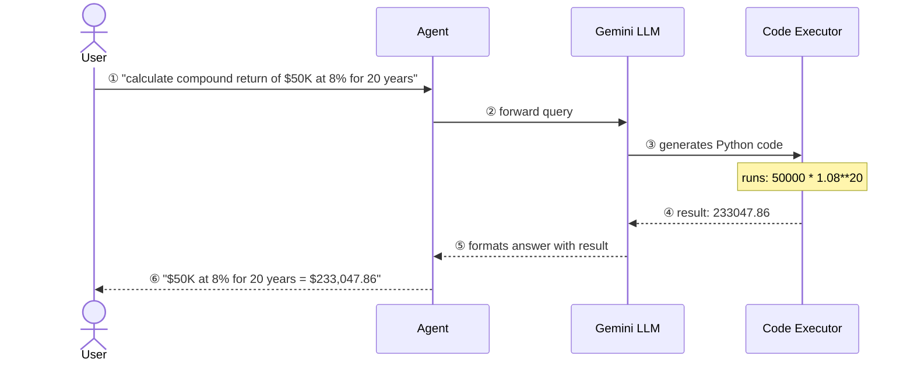
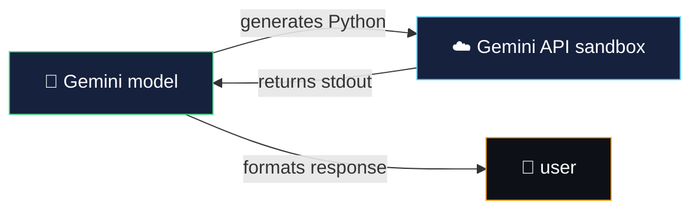
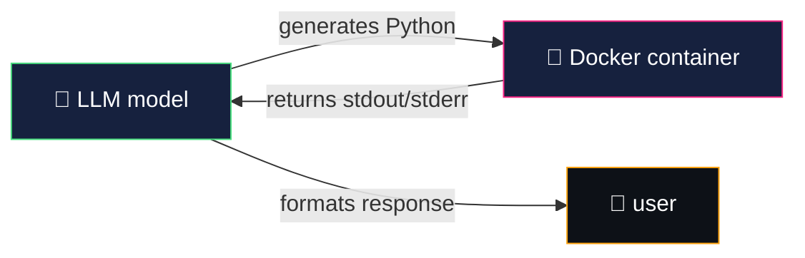

# code execution — giving your agent a python REPL

> code execution lets the model **dynamically write and run Python code** to solve problems,
> rather than relying on pre-written tool functions or the model's own (often imprecise) math.

think of it like giving your agent a scratchpad with a python interpreter.
instead of guessing "what is 50000 × 1.08^20?", it writes `50000 * 1.08**20`, runs it,
and returns the **exact** answer: $233,047.86.

---

## how code execution fits into the agent flow



---

## the 5 code executors

ADK provides different backends for running model-generated code:

| executor | where code runs | requires | best for |
|---|---|---|---|
| `BuiltInCodeExecutor` | Gemini API server-side | API key only | local dev, simplest setup |
| `ContainerCodeExecutor` | local Docker container | Docker Desktop | local sandboxed execution |
| `UnsafeLocalCodeExecutor` | your process via `exec()` | nothing | quick tests (no sandbox!) |
| `AgentEngineSandboxCodeExecutor` | Google Cloud sandbox | GCP project | production cloud apps |
| `VertexAiCodeExecutor` | Vertex AI | GCP project | production cloud apps |

---

## BuiltInCodeExecutor — the simplest option

the model generates Python code, and **Gemini's API runs it server-side** in its own sandbox.
no local sandbox or cloud project needed — just your API key.

### how it works



### setup

```python
from google.adk.code_executors import BuiltInCodeExecutor

agent = LlmAgent(
    name="Calculator",
    model="gemini-2.0-flash",
    code_executor=BuiltInCodeExecutor(),
    instruction="write and execute Python code to solve problems.",
)
```

### key details

| property | value |
|---|---|
| requires | Gemini 2.0+ model, API key |
| sandbox | Gemini's server-side sandbox (isolated) |
| stateful | yes — state persists across tool calls within a session |
| limitation | **single tool per agent** — cannot mix with other tools |

> ⚠️ **single-tool-per-agent rule**: when using `code_executor`, the agent cannot have
> any other tools. workaround: create a dedicated sub-agent for code execution.

---

## ContainerCodeExecutor — local Docker sandbox

the model generates Python code, and **a local Docker container runs it**.
gives you full control over the execution environment and installed packages.

### how it works



### setup

```python
from google.adk.code_executors import ContainerCodeExecutor

agent = LlmAgent(
    name="Calculator",
    model="gemini-2.0-flash",
    code_executor=ContainerCodeExecutor(
        image="python:3.12-slim",          # use any Docker image
        # docker_path="./my_dockerfile/",  # or build from a Dockerfile
    ),
    instruction="write and execute Python code to solve problems.",
)
```

### key details

| property | value |
|---|---|
| requires | Docker Desktop installed and running, `docker` pip package |
| sandbox | isolated Docker container (strong process-level isolation) |
| stateful | no — each execution is independent |
| supports custom packages | yes — use a custom Docker image with pre-installed libraries |
| limitation | **single tool per agent** (same rule as BuiltInCodeExecutor) |

---

## BuiltIn vs Container vs custom tools

| | custom tools | BuiltInCodeExecutor | ContainerCodeExecutor |
|---|---|---|---|
| **code is...** | pre-written by you | dynamically generated by model | dynamically generated by model |
| **flexibility** | fixed logic only | model writes any Python | model writes any Python |
| **accuracy** | deterministic (exact) | deterministic (exact) | deterministic (exact) |
| **setup** | none | API key | Docker Desktop |
| **sandbox** | runs in your process | Gemini server-side | Docker container |
| **custom packages** | yes (your env) | no (Gemini's sandbox) | yes (custom image) |
| **best for** | known, repeated calculations | ad-hoc math, data analysis | complex tasks needing libraries |

---

## what we'll build in WealthPilot

we'll use **custom tool functions** for financial calculations in WealthPilot:

| tool | what it does |
|---|---|
| `calculate_compound_returns` | projects investment growth with year-by-year breakdown |
| `calculate_portfolio_allocation` | computes dollar amounts from percentage allocations |

> ⚠️ **why tools instead of code executors?** `BuiltInCodeExecutor` conflicts with Gemini's
> automatic `transfer_to_agent` function declarations in multi-agent setups — the API rejects
> mixing built-in tools with function calling in the same request.

---

## docs & references

- [BuiltInCodeExecutor — Gemini API Code Execution](https://google.github.io/adk-docs/integrations/code-execution/)
- [ContainerCodeExecutor — source code (GitHub)](https://github.com/google/adk-python/blob/main/src/google/adk/code_executors/container_code_executor.py)
- [AgentEngineSandboxCodeExecutor — Agent Engine Code Execution](https://google.github.io/adk-docs/integrations/code-exec-agent-engine/)
