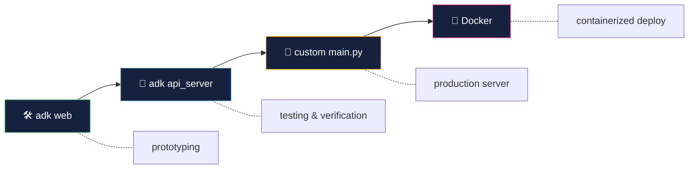
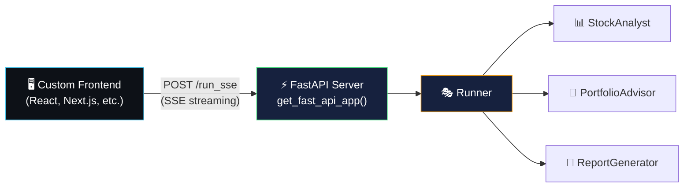
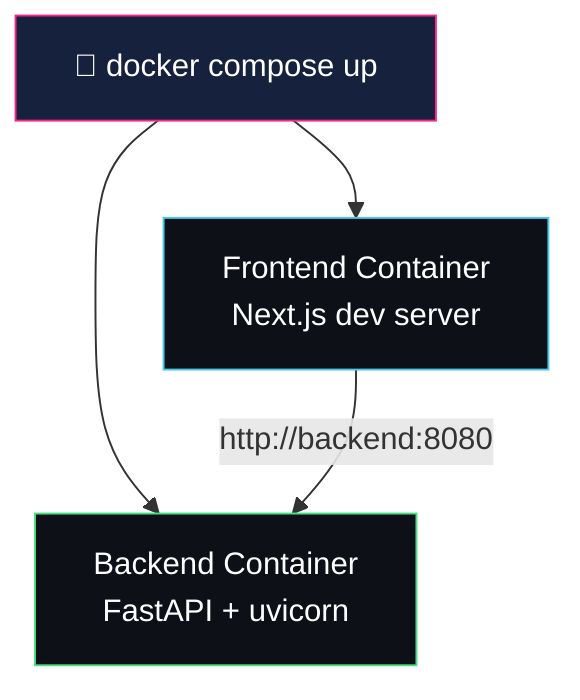

# local deployment — running and testing your agents

> ADK gives you multiple ways to run agents locally — from quick prototyping with `adk web`
> to production-ready deployments with custom UIs and Docker.

---

## 4 ways to run locally

| command | what it does | interface | best for |
|---|---|---|---|
| `adk web` | dev UI + API server | browser (http://localhost:8000) | prototyping, debugging |
| `adk run` | terminal REPL | interactive CLI | quick testing |
| `adk api_server` | headless REST API | curl, Postman, Swagger | programmatic testing, verification |
| custom `main.py` | your own FastAPI server | anything you build | production, custom UIs |



> 💡 **key insight**: `adk web`, `adk run`, and `adk api_server` all create a `Runner` for you
> automatically. a custom `main.py` is where **you** build the Runner.

---

## `adk api_server` — testing your agent

the API server exposes your agent as a REST API without a UI — perfect for verification
before deploying.

### starting the server

```bash
adk api_server wealth_pilot
```

this starts a FastAPI server on `http://localhost:8000` with:
- all REST endpoints for sessions, execution, and artifacts
- **Swagger docs** at `http://localhost:8000/docs` — interactive API explorer

### testing with curl

**1. list available agents**
```bash
curl -X GET http://localhost:8000/list-apps
# → ["wealth_pilot"]
```

**2. create a session**
```bash
curl -X POST http://localhost:8000/apps/wealth_pilot/users/user1/sessions \
  -H "Content-Type: application/json" \
  -d '{}'
# → {"id": "abc-123", ...}
```

**3. send a message (batch)**
```bash
curl -X POST http://localhost:8000/run \
  -H "Content-Type: application/json" \
  -d '{
    "appName": "wealth_pilot",
    "userId": "user1",
    "sessionId": "abc-123",
    "newMessage": {
      "role": "user",
      "parts": [{"text": "analyze AAPL"}]
    }
  }'
```

**4. send a message (streaming SSE)**
```bash
curl -X POST http://localhost:8000/run_sse \
  -H "Content-Type: application/json" \
  -d '{
    "appName": "wealth_pilot",
    "userId": "user1",
    "sessionId": "abc-123",
    "streaming": true,
    "newMessage": {
      "role": "user",
      "parts": [{"text": "build me a portfolio"}]
    }
  }'
```

---

## API endpoints reference

| method | path | what it does |
|---|---|---|
| `GET` | `/list-apps` | list discovered agents |
| `POST` | `/apps/{app}/users/{user}/sessions` | create a session |
| `GET` | `/apps/{app}/users/{user}/sessions/{session}` | get session (state + events) |
| `PATCH` | `/apps/{app}/users/{user}/sessions/{session}` | update session state |
| `DELETE` | `/apps/{app}/users/{user}/sessions/{session}` | delete a session |
| `POST` | `/run` | execute agent (batch — returns all events) |
| `POST` | `/run_sse` | execute agent (streaming SSE) |
| `GET` | `/apps/{app}/users/{user}/sessions/{session}/artifacts/{name}` | get an artifact |

> 💡 these are the **exact same endpoints** the Dev UI (`adk web`) uses internally.

---

## `get_fast_api_app()` — your production server

when you're ready to go beyond the CLI tools, ADK provides `get_fast_api_app()`
to create a production-ready FastAPI application:

```python
from google.adk.cli.fast_api import get_fast_api_app

app = get_fast_api_app(
    agents_dir=".",                  # directory containing agent folders
    allow_origins=["*"],             # CORS origins for your frontend
    web=False,                       # False = API only, True = include Dev UI
    session_service_uri=None,        # None = InMemory, "sqlite+aiosqlite:///./db" = persistent
)
```

### key parameters

| parameter | default | what it does |
|---|---|---|
| `agents_dir` | required | parent directory containing agent package folders |
| `allow_origins` | `[]` | CORS allowed origins for custom frontends |
| `web` | `True` | `True` = serve Dev UI + API, `False` = API only |
| `session_service_uri` | `None` | `None` = InMemory, or a database URI for persistence |

### architecture with a custom UI



---

## connecting a custom UI

any frontend can connect to the ADK API server — the flow is:

1. **create session** → `POST /apps/{app}/users/{user}/sessions`
2. **send messages** → `POST /run_sse` with SSE streaming
3. **parse SSE events** → each `data:` line is a JSON event with `content.parts[].text`
4. **track agents** → `event.author` shows which sub-agent is active
5. **detect artifacts** → `actions.artifactDelta` in events signals saved files
6. **download artifacts** → `GET /apps/{app}/users/{user}/sessions/{session}/artifacts/{name}`

---

## containerized deployment with Docker

for a fully isolated local deployment:



- **backend**: `main.py` using `get_fast_api_app()` + uvicorn
- **frontend**: any framework (React, Next.js, etc.)
- **hot reload**: bind mounts + `--reload` for instant feedback during development

---

## what we'll build in WealthPilot

| step | what we do |
|---|---|
| test with `adk api_server` | verify all agents, tools, and artifacts work via curl |
| create `main.py` | production FastAPI server with `get_fast_api_app()` |
| Docker Compose | backend + frontend containers with hot reload |
| custom chat UI | Next.js frontend connecting via SSE |

---

## docs & references

- [ADK API Server](https://google.github.io/adk-docs/runtime/api-server/)
- [Deploy to Cloud Run](https://google.github.io/adk-docs/deploy/cloud-run/)
