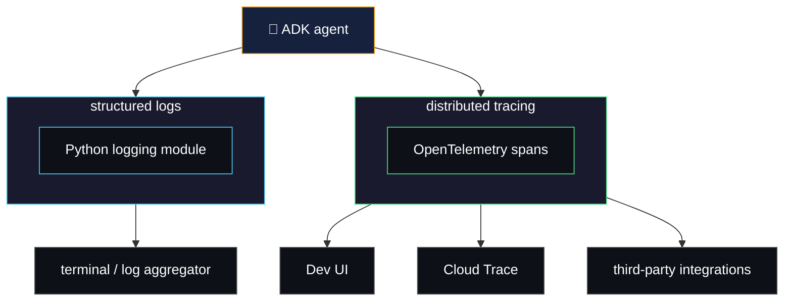
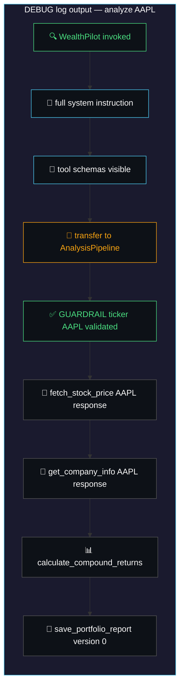
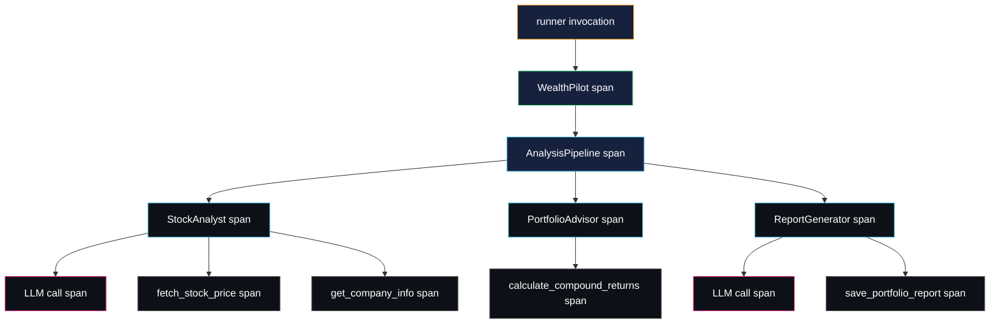

# observability — seeing inside your agents

> observability means being able to answer: *what is my agent actually doing, and why?*
> ADK gives you two built-in systems — structured logs and distributed traces —
> plus integrations that pipe those signals into production dashboards.

think of it like a driver watching their dashboard. the car either arrives or it doesn't —
but the dashboard shows real-time readings: engine temp, oil pressure, RPM, and warning lights.
you don't wait for the car to break down. you monitor signals continuously and act before
things go wrong. ADK is the engine. observability is your dashboard.

---

## the ADK observability systems



---

## structured logging

ADK uses Python's standard `logging` module. four levels control how much you see:

| level | what you get |
|---|---|
| `DEBUG` | full LLM prompts, system instructions, tool args, state transitions |
| `INFO` | agent lifecycle, sessions created, tools called — **default** |
| `WARNING` | deprecated features, potential issues |
| `ERROR` | failed API calls, caught exceptions |

> `DEBUG` is your primary debugging tool. it shows the exact prompt the model receives,
> including the full system instruction, conversation history, and all tool schemas.

### controlling log level

via the CLI:

```bash
# dev UI with full debug output
adk web --log_level DEBUG wealth_pilot

# terminal REPL with debug output
adk run --log_level DEBUG wealth_pilot
```

programmatically (for `python main.py`, Docker, or custom runners):

```python
import logging

logging.basicConfig(
    level=logging.DEBUG,
    format='%(asctime)s - %(levelname)s - %(name)s - %(message)s'
)
```

add this **before** your `Runner` or `get_fast_api_app()` call.

---

## what DEBUG logs reveal in WealthPilot

a single "analyze AAPL" query through the full pipeline surfaces:



each log line carries the agent name as a prefix — so in a multi-agent chain you can
trace exactly which sub-agent handled each step.

---

## distributed tracing

ADK instruments every execution automatically using **OpenTelemetry (OTel)** spans.
every agent invocation, LLM call, and tool execution emits a structured span — you
don't write any tracing code.

### how spans nest



### trace viewers

| viewer | where | what it shows |
|---|---|---|
| **Dev UI** | `http://localhost:8000` — built-in | expandable event tree per session turn |
| **Cloud Trace** | GCP Console — requires `--trace_to_cloud` | persisted production traces, latency waterfall |

### dev UI — built-in local viewer

running `adk web` provides a zero-config trace viewer. every session turn renders as
an expandable event tree:

| what you can expand | what you see inside |
|---|---|
| agent node | LLM request, system instruction, model response |
| tool call node | input arguments, raw tool output |
| callback node | before/after intercept, any override returned |
| artifact node | filename, version number, mime type |

> no external account required. the limitation is that traces are in-memory and
> lost on restart — they're for local debugging, not production monitoring.

### cloud trace — production distributed tracing

passes all OTel spans to Google Cloud Trace. the same trace hierarchy from the Dev UI,
now persisted and queryable in GCP.

```bash
adk deploy cloud_run \
  --project=$GOOGLE_CLOUD_PROJECT \
  --region=$GOOGLE_CLOUD_LOCATION \
  --service_name="wealth-pilot-service" \
  --allow_origins="*" \
  --trace_to_cloud \
  wealth_pilot \
  -- --set-secrets="GOOGLE_API_KEY=google-api-key:latest" \
     --set-env-vars="GOOGLE_GENAI_USE_VERTEXAI=0,OTEL_INSTRUMENTATION_GENAI_CAPTURE_MESSAGE_CONTENT=true"
```

> by default, prompt content is redacted from spans for privacy.
> `OTEL_INSTRUMENTATION_GENAI_CAPTURE_MESSAGE_CONTENT=true` enables it.

view traces at: **GCP Console → Observability → Trace → Trace List**

---

## integrations

ADK's OpenTelemetry foundation makes it compatible with any OTel-compatible platform.
these are third-party tools that consume the traces and logs ADK emits:

| integration | what it specialises in |
|---|---|
| **AgentOps** | agent-native session replays, cost tracking, LLM dashboards |
| **Google Cloud Trace** | native GCP distributed tracing (built-in via `--trace_to_cloud`) |
| **Arize AX** | ML observability, data drift detection |
| **MLflow** | experiment tracking, model lifecycle |
| **LangWatch** | LLM analytics, conversation quality |
| **Galileo** | hallucination detection, guardrail monitoring |
| **Phoenix** | open-source self-hosted LLM observability |
| **W&B Weave** | weights & biases tracing |

> see all integrations at [adk.dev/integrations/?topic=observability](https://adk.dev/integrations/?topic=observability)

### agentops

agentops is purpose-built for AI agents — not just LLMs. it understands agent hierarchies
and replaces ADK's built-in no-op OTel tracer, becoming the single authoritative sink.
no duplicate traces.

#### what it captures automatically

| signal | detail |
|---|---|
| agent execution spans | every `LlmAgent` and `SequentialAgent` invocation |
| LLM call spans | model, token counts, latency, finish reason |
| tool call spans | tool name, input args, output result |
| cost per call | token counts × model pricing |

#### setup — local (`agent.py`)

```python
# wealth_pilot/agent.py — before any google.adk imports
import agentops
agentops.init()  # reads AGENTOPS_API_KEY from env

from google.adk.agents import LlmAgent, SequentialAgent
# ... rest of file unchanged
```

#### setup — production (`main.py`)

```python
# wealth_pilot/main.py — before get_fast_api_app()
import agentops
agentops.init()

app = get_fast_api_app(...)
```

#### installation

```bash
uv add agentops
```

```bash
# .env
AGENTOPS_API_KEY=your-key-here
```

get your key at [app.agentops.ai](https://app.agentops.ai) → Settings → API Keys

---

## when to use what

| scenario | reach for |
|---|---|
| debugging a weird agent response locally | `--log_level DEBUG` |
| tracing which sub-agent made a mistake | Dev UI event tree |
| monitoring latency of a live service | `--trace_to_cloud` + Cloud Trace |
| tracking LLM cost and usage over time | AgentOps |
| compliance / audit trail | structured logs + a log aggregator |

---

## what we'll instrument in WealthPilot

| where | what we add | what it surfaces |
|---|---|---|
| `adk web` CLI | `--log_level DEBUG` | full prompt chain and callbacks firing |
| Dev UI | built-in — zero config | visual event tree per turn |
| Cloud Run | `--trace_to_cloud` flag | production traces in GCP Console |
| `agent.py` | `agentops.init()` | local session replays in AgentOps dashboard |
| `main.py` | `agentops.init()` | production session replays in AgentOps dashboard |

---

## docs & references

- [ADK observability overview](https://adk.dev/observability/)
- [ADK logging](https://adk.dev/observability/logging/)
- [ADK observability integrations](https://adk.dev/integrations/?topic=observability)
- [AgentOps for ADK](https://adk.dev/integrations/agentops/)
- [OpenTelemetry GenAI semantic conventions](https://github.com/open-telemetry/semantic-conventions/blob/main/docs/gen-ai/gen-ai-events.md)
