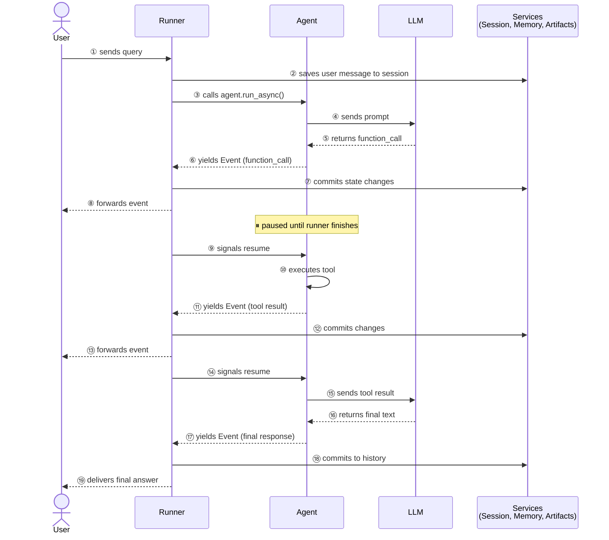
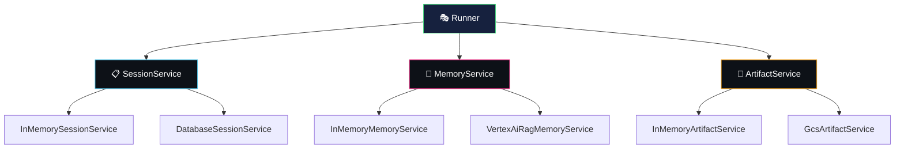

# runner & event loop — the engine behind your agents

> the runner is the **execution engine** that orchestrates everything: it receives user queries,
> drives agents, processes events, commits state changes, and delivers responses.

think of the runner as a **stage manager** in a theater. the agents are actors performing scenes,
the events are their cues, and the stage manager coordinates everything — making sure props (state)
are in the right place, the curtain rises at the right time, and what the audience (user) sees
is polished and sequential.

---

## the event loop

the core pattern in ADK is an **event loop** — a back-and-forth between the runner and your agents:

> 💡 **key insight**: the agent **pauses** after every yielded event and only resumes after the
> runner has committed all changes. this ensures state is always consistent.

---

## key components

| component | role | examples |
|---|---|---|
| **Runner** | orchestrator — drives the event loop | `Runner` from `google.adk.runners` |
| **Event** | message between runner and agent | function call, tool result, final text, state delta |
| **Session** | conversation state + history | managed by `SessionService` |
| **Services** | persistence backends | SessionService, MemoryService, ArtifactService |
| **InvocationContext** | context for a single user query | carries session, services, invocation ID |

---

## the 3 services

the runner connects your agent to three backend services:

| service | manages | InMemory (dev) | persistent (prod) |
|---|---|---|---|
| **SessionService** | state, event history | `InMemorySessionService` | `DatabaseSessionService` |
| **MemoryService** | cross-session recall | `InMemoryMemoryService` | `VertexAiRagMemoryService` |
| **ArtifactService** | files (reports, images) | `InMemoryArtifactService` | `GcsArtifactService` |

---

## event types

events are the currency of the event loop — each one represents something that happened:

| event type | what it contains | example |
|---|---|---|
| user input | the user's message | "analyze AAPL for me" |
| function call | LLM wants to call a tool | `fetch_stock_price(ticker="AAPL")` |
| function response | tool result | `{"price": 185.50, ...}` |
| final text | agent's response to user | "AAPL is trading at $185.50..." |
| state delta | state changes to commit | `{"user_preferences": {...}}` |

---

## session vs invocation

| | session | invocation |
|---|---|---|
| **scope** | entire conversation | single user query |
| **contains** | all events, full state | events for one query |
| **ID** | `session.id` | `invocation_id` |
| **lifetime** | until deleted | starts and ends with one `run_async()` call |

---

## state prefixes

state keys can be scoped by prefix:

| prefix | scope | persists across | example |
|---|---|---|---|
| (none) | session | queries in same session | `user_name` |
| `app:` | application | all sessions, all users | `app:model_version` |
| `temp:` | invocation | ❌ discarded after query | `temp:current_ticker` |

---

## `adk web` vs programmatic runner

| | `adk web` | programmatic `Runner` |
|---|---|---|
| **setup** | zero — just run `adk web` | you configure everything |
| **services** | InMemory (auto-configured) | you choose backends |
| **UI** | built-in web UI | your own (terminal, API, frontend) |
| **best for** | development, demos | production, testing, custom apps |

> 💡 `adk web` creates a `Runner` for you under the hood. building your own Runner
> is what you'd do for production deployments or custom UIs.

---

## what we'll build in WealthPilot

| feature | what it does |
|---|---|
| `run_full.py` | programmatic Runner with all 3 services, interactive terminal loop using `run_async()` |

---

## docs & references

- [ADK Runtime Event Loop](https://google.github.io/adk-docs/runtime/event-loop/)
