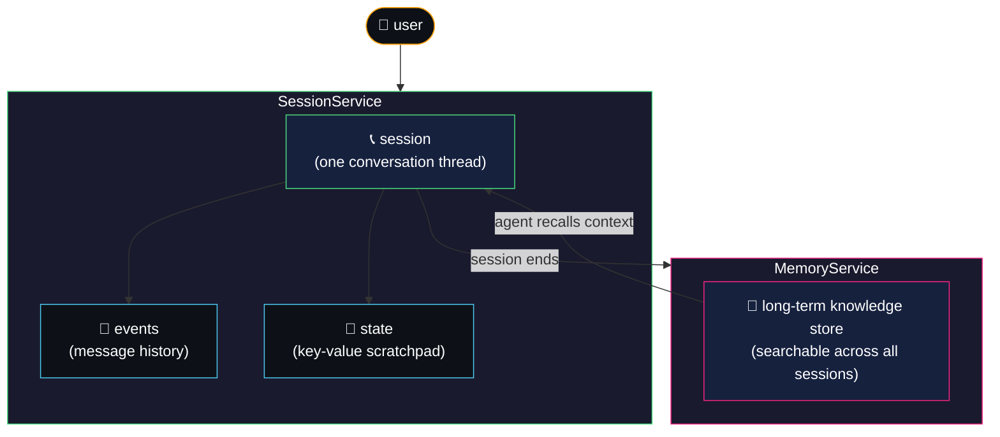
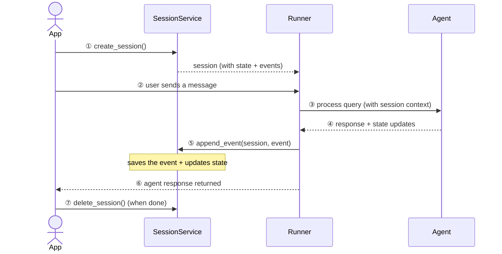
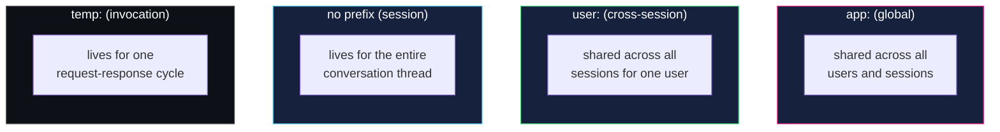
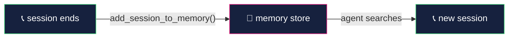

# session, state & memory — how agents remember

> **session** is the conversation thread. **state** is the notepad you scribble on during it.
> **memory** is the file cabinet where you store notes from all past conversations.

think of it like a phone call: the session is one call, state is what you jot down
while talking, and memory is your CRM where you log everything after hanging up —
so next time you call, you already know who you're talking to.

---

## how session, state, and memory relate

---

## session — the conversation container

a session is a single conversation thread between a user and your agent system.
it holds the full history of messages plus a scratchpad for temporary data.

| property | what it holds |
|---|---|
| `id` | unique identifier for this conversation thread |
| `app_name` | which agent app this belongs to |
| `user_id` | which user is chatting |
| `events` | chronological list of messages and actions |
| `state` | key-value scratchpad (see below) |
| `last_update_time` | when the session was last touched |

### session lifecycle

---

## state — the session's scratchpad

`session.state` is a dictionary of key-value pairs. it lets agents track information
during a conversation without polluting the message history.

### the four prefix scopes

this is the most important concept — **prefixes control how far state reaches**:

| prefix | scope | persists across sessions? | example |
|---|---|---|---|
| *(none)* | this session only | no | `state['risk_tolerance'] = 'moderate'` |
| `user:` | this user, all sessions | yes | `state['user:name'] = 'George'` |
| `app:` | all users, all sessions | yes | `state['app:disclaimer'] = '...'` |
| `temp:` | this invocation only | no (discarded after) | `state['temp:raw_response'] = {...}` |

### how state gets updated

two recommended methods:

| method | how it works |
|---|---|
| `output_key` on `LlmAgent` | automatically saves the agent's response text to a state key |
| `tool_context.state` | read/write state from inside any tool function |

---

## SessionService implementations

ADK provides different backends — pick the one that fits your deployment:

| service | storage | best for |
|---|---|---|
| `InMemorySessionService` | RAM (lost on restart) | local dev and testing |
| `DatabaseSessionService` | SQLite / PostgreSQL | production persistence |
| `VertexAiSessionService` | Google Cloud | managed cloud deployments |

---

## memory — cross-session recall

memory is a **searchable knowledge store** that spans across conversations.
when a session ends, its contents can be ingested into memory. future sessions
can then search that store to recall context from past interactions.

### how memory works

### built-in memory tools

| tool | behavior |
|---|---|
| `PreloadMemoryTool` | automatically loads relevant memories at the start of each turn |
| `LoadMemoryTool` | agent decides when to search memory (on-demand) |

### MemoryService implementations

| service | storage | best for |
|---|---|---|
| `InMemoryMemoryService` | RAM (lost on restart) | local dev and testing |
| `VertexAiMemoryService` | Google Cloud Memory Bank | production with managed search |

---

## what we'll build in WealthPilot

| feature | concept | what it does |
|---|---|---|
| risk tolerance tracking | state (no prefix) | stores the user's risk tolerance for the current conversation |
| user preferences | state (`user:` prefix) | remembers the user's name and preferred investment style across sessions |
| conversation recall | memory | recalls past portfolio analyses from previous conversations |

---

## session vs state vs memory — when to use what

| question | use |
|---|---|
| need data for this conversation only? | **state** (no prefix) |
| need data across all conversations for one user? | **state** (`user:` prefix) |
| need data shared across all users? | **state** (`app:` prefix) |
| need temporary scratch data within one request? | **state** (`temp:` prefix) |
| need searchable recall of past conversations? | **memory** |
| need the raw conversation history? | **session.events** |
