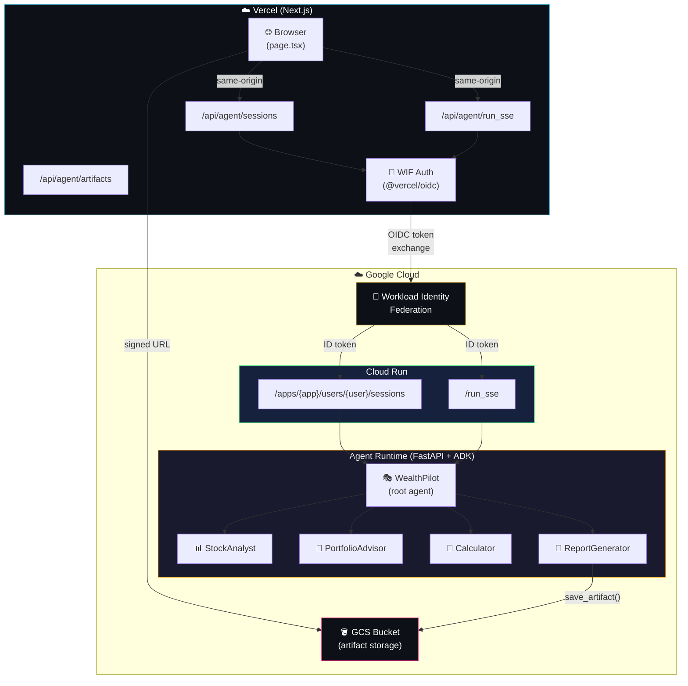

# WealthPilot V2 — Cloud Run + Vercel production deployment

deploy WealthPilot to production using Cloud Run (backend)
and Vercel (frontend), with Workload Identity Federation for keyless auth
and GCS for artifact storage.

> **this is an extension to the [multi-agent systems with ADK](../../) course.**
> the WealthPilot agent code is NOT modified — only the deployment target
> and frontend proxy layer change.

## architecture



## V1 vs V2

| | V1 (Cloud Run, no auth) | V2 (Cloud Run + IAM auth) |
|---|---|---|
| **backend** | Cloud Run + FastAPI (`adk deploy cloud_run`) | Cloud Run + FastAPI (`adk deploy cloud_run`) |
| **auth** | none (public endpoint) | WIF — keyless OIDC federation → ID token → Cloud Run IAM |
| **sessions** | in-memory | in-memory (per Cloud Run instance) |
| **artifacts** | in-memory (lost on restart) | GCS bucket (persistent) |
| **frontend** | direct calls to Cloud Run `/run_sse` | Next.js API route proxy → Cloud Run |
| **scaling** | Cloud Run auto-scale | Cloud Run auto-scale |
| **infrastructure** | manual `gcloud` commands | Pulumi YAML (declarative IaC) |

## directory structure

```
extensions/v2/
├── README.md                            # this file
├── infra/                               # Pulumi YAML — GCP infrastructure
│   ├── Pulumi.yaml                      # WIF pool, SA, GCS bucket, IAM
│   ├── Pulumi.dev.yaml.example          # dev stack config template (copy → Pulumi.dev.yaml)
│   ├── .passphrase.example              # passphrase template
│   └── README.md                        # infra-specific docs
└── docs/                                # deployment lecture notes
    └── cloud_run_deployment_v2.md       # V2 deployment guide (Cloud Run + WIF)
```

## quick start

### 1. provision infrastructure

```bash
cd extensions/v2/infra
export PULUMI_CONFIG_PASSPHRASE_FILE=.passphrase

pulumi login gs://<YOUR_GCP_PROJECT_ID>-pulumi-state
pulumi stack init dev
pulumi up
```

see [`infra/README.md`](infra/README.md) for detailed setup instructions.

### 2. deploy backend

```bash
export GOOGLE_CLOUD_PROJECT="<YOUR_GCP_PROJECT_ID>"
export GOOGLE_CLOUD_LOCATION="us-central1"

adk deploy cloud_run \
  --project=$GOOGLE_CLOUD_PROJECT \
  --region=$GOOGLE_CLOUD_LOCATION \
  --service_name=wealth-pilot-service \
  wealth_pilot
```

save the Cloud Run service URL from the output.

### 3. deploy frontend

```bash
cd wealth_pilot_ui

# install proxy dependencies
npm i google-auth-library @vercel/oidc

# set env vars (see table below) — use printf, not echo, to avoid trailing newlines
printf "https://wealth-pilot-service-xxxx-uc.a.run.app" | vercel env add CLOUD_RUN_URL production
# ... (all env vars)

# enable OIDC in Vercel Dashboard → Settings → Security
# enable unauthenticated OIDC token generation

# deploy
vercel --prod
```

## environment variables

### Vercel (server-side)

| variable | value | source |
|----------|-------|--------|
| `GCP_PROJECT_ID` | `<YOUR_GCP_PROJECT_ID>` | GCP console |
| `GCP_PROJECT_NUMBER` | `<YOUR_GCP_PROJECT_NUMBER>` | GCP console |
| `GCP_SERVICE_ACCOUNT_EMAIL` | `vercel-wealthpilot@<YOUR_GCP_PROJECT_ID>.iam.gserviceaccount.com` | `pulumi stack output` |
| `GCP_WORKLOAD_IDENTITY_POOL_ID` | `vercel` | `pulumi stack output` |
| `GCP_WORKLOAD_IDENTITY_POOL_PROVIDER_ID` | `vercel` | `pulumi stack output` |
| `CLOUD_RUN_URL` | `https://wealth-pilot-service-xxxx-uc.a.run.app` | `adk deploy` output |
| `ADK_APP_NAME` | `wealth_pilot` | agent directory name |
| `GCP_ARTIFACTS_BUCKET` | `<from pulumi>` | `pulumi stack output` |

> **warning:** when setting env vars via `vercel env add`, pipe the value with `printf`
> (not `echo`). `echo` appends a trailing newline (`\n`) which gets embedded in the
> ID token's `aud` claim, causing Cloud Run to reject every request with 401.
>
> ```bash
> # correct
> printf "https://your-service-url.run.app" | vercel env add CLOUD_RUN_URL production
>
> # wrong — embeds trailing \n in the token audience
> echo "https://your-service-url.run.app" | vercel env add CLOUD_RUN_URL production
> ```

### Vercel (public)

| variable | value |
|----------|-------|
| `NEXT_PUBLIC_ENABLE_WEALTHPILOT_V2` | `false` |

## how it works

### authentication flow

1. browser calls `/api/agent/run_sse` on the same Vercel domain (same-origin)
2. the API route uses `@vercel/oidc` to get a Vercel OIDC token
3. the token is exchanged at GCP's STS endpoint via Workload Identity Federation
4. GCP returns a short-lived access token (impersonating the SA)
5. the API route calls `iamcredentials.googleapis.com/generateIdToken` to get an ID token
   with the Cloud Run service URL as the audience
6. the API route calls Cloud Run with the ID token in the `Authorization: Bearer` header
7. Cloud Run IAM validates the ID token and streams SSE events back through the proxy

### artifact flow

1. the `ReportGenerator` agent calls `save_portfolio_report()`
2. the tool uses `tool_context.save_artifact()` → `GcsArtifactService` uploads to GCS
3. the agent includes artifact info in its response
4. the frontend shows a download button
5. clicking it calls `/api/agent/artifacts` which generates a GCS signed URL
6. the browser opens the signed URL — PDF displays inline

## references

- [ADK Cloud Run deployment](https://google.github.io/adk-docs/deploy/cloud-run/)
- [Vercel OIDC + GCP](https://vercel.com/docs/security/secure-backend-access/oidc/gcp)
- [Workload Identity Federation](https://cloud.google.com/iam/docs/workload-identity-federation)
- [Cloud Run IAM authentication](https://cloud.google.com/run/docs/authenticating/service-to-service)
- [GCS signed URLs](https://cloud.google.com/storage/docs/access-control/signed-urls)
- [Pulumi GCP provider](https://www.pulumi.com/registry/packages/gcp/)
