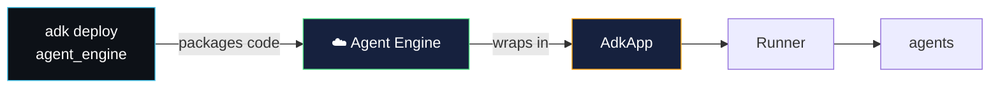
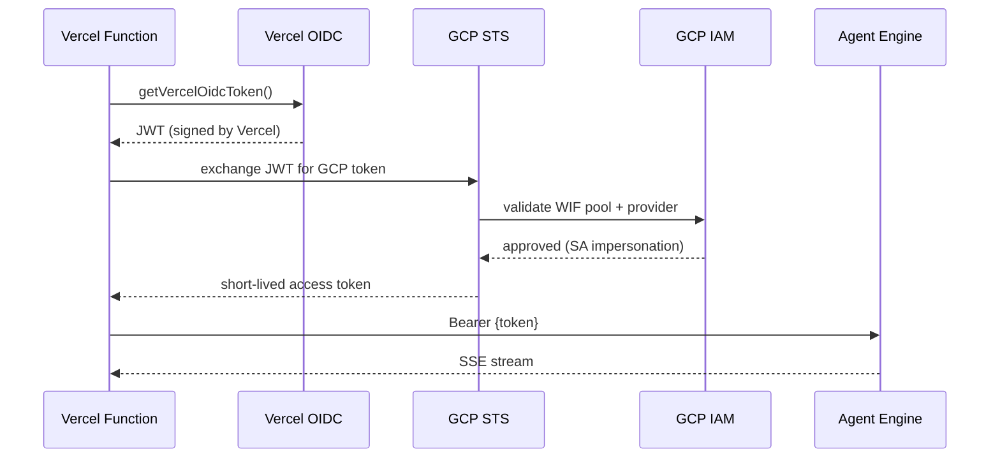

# agent engine deployment — V2 production flow

> deploy WealthPilot to Vertex AI Agent Engine with managed sessions,
> GCS artifacts, and a Vercel frontend proxy using Workload Identity Federation.

---

## what is Agent Engine?

Agent Engine is Google Cloud's fully managed runtime for ADK agents. unlike Cloud Run
(where you deploy a container with FastAPI), Agent Engine:

- **runs your agent code directly** — no Dockerfile, no `main.py`
- **manages sessions** via Vertex AI Session Service (persistent, not in-memory)
- **auto-scales** including scale-to-zero
- **exposes REST API** — `:query` and `:streamQuery?alt=sse`



---

## V1 vs V2 architecture

### V1: Cloud Run

```
browser → Cloud Run (FastAPI + ADK) → Gemini API
                ↓
          /run_sse (public, no auth)
```

### V2: Agent Engine

```
browser → Vercel (Next.js proxy) → Agent Engine (managed)
              ↓                          ↓
        /api/agent/run_sse         :streamQuery?alt=sse
        (same-origin)              (OAuth2 Bearer via WIF)
```

key difference: Agent Engine requires **OAuth2 authentication**. since browser-side
code can't hold GCP credentials, the Vercel frontend acts as a proxy — receiving
requests from the browser, authenticating with Agent Engine via WIF, and streaming
responses back.

---

## deployment steps

### 1. provision infrastructure

all GCP resources are managed via Pulumi YAML in `extensions/v2/infra/`:

```bash
cd extensions/v2/infra
export PULUMI_CONFIG_PASSPHRASE_FILE=.passphrase
pulumi up
```

this creates:
- WIF identity pool + OIDC provider (Vercel → GCP trust)
- service account with `roles/aiplatform.user`
- GCS bucket for artifact storage
- IAM bindings for WIF → SA impersonation

### 2. deploy agent to Agent Engine

```bash
export GOOGLE_CLOUD_PROJECT="<YOUR_GCP_PROJECT_ID>"
export GOOGLE_CLOUD_LOCATION="us-central1"

adk deploy agent_engine \
  --project=$GOOGLE_CLOUD_PROJECT \
  --region=$GOOGLE_CLOUD_LOCATION \
  --display_name="WealthPilot" \
  wealth_pilot
```

the CLI:
1. reads `.ae_ignore` to exclude files (`.venv`, `__pycache__`, `.env`, `main.py`, etc.)
2. packages the agent code
3. creates an `AdkApp` wrapper with `async_stream_query`, `async_create_session` methods
4. deploys to Agent Engine as a managed `reasoningEngine`

### 3. verify with curl

```bash
export TOKEN=$(gcloud auth print-access-token)
export AE_URL="https://us-central1-aiplatform.googleapis.com/v1/projects/<YOUR_GCP_PROJECT_ID>/locations/us-central1/reasoningEngines/<RESOURCE_ID>"

# create session
curl -H "Authorization: Bearer $TOKEN" \
     -H "Content-Type: application/json" \
     "${AE_URL}:query" \
     -d '{"class_method": "async_create_session", "input": {"user_id": "test"}}'

# stream query
curl -H "Authorization: Bearer $TOKEN" \
     -H "Content-Type: application/json" \
     "${AE_URL}:streamQuery?alt=sse" \
     -d '{"class_method": "async_stream_query", "input": {"user_id": "test", "session_id": "SESSION_ID", "message": "analyze AAPL"}}'
```

---

## Agent Engine API surface

the `AdkApp` wrapper exposes these methods as REST endpoints:

| method | REST endpoint | purpose |
|--------|--------------|---------|
| `async_create_session` | `POST :query` | creates a new session for a user |
| `async_stream_query` | `POST :streamQuery?alt=sse` | streams agent response as SSE events |

### request format

```json
{
  "class_method": "async_stream_query",
  "input": {
    "user_id": "demo_user",
    "session_id": "session-123",
    "message": "analyze AAPL"
  }
}
```

### event format

Agent Engine uses `event.model_dump_json(exclude_none=True)` — the **exact same
ADK Event format** as Cloud Run's `/run_sse`. the SSE payloads are identical,
only the transport layer (auth + URL) differs.

---

## Workload Identity Federation

WIF enables **keyless** authentication between Vercel and GCP:



no service account keys are stored anywhere. Vercel's OIDC token is exchanged
for a short-lived GCP access token at runtime.

---

## GCS artifact storage

in V1, artifacts use `InMemoryArtifactService` (lost on restart). in V2, we use
`GcsArtifactService` which persists to a GCS bucket:

| | V1 | V2 |
|---|---|---|
| **storage** | RAM | GCS bucket |
| **persistence** | lost on restart | permanent |
| **download** | proxy via `main.py` | GCS signed URL |

the `save_portfolio_report` tool doesn't change — it uses the standard
`tool_context.save_artifact()` API. only the underlying service changes.

---

## docs & references

- [ADK Agent Engine deployment](https://adk.dev/deploy/agent-engine/deploy/)
- [using an agent on Agent Engine](https://adk.dev/deploy/agent-engine/deploy/#using-an-agent-on-agent-engine)
- [Vercel OIDC + GCP](https://vercel.com/docs/security/secure-backend-access/oidc/gcp)
- [Workload Identity Federation](https://cloud.google.com/iam/docs/workload-identity-federation)
- [GcsArtifactService](https://google.github.io/adk-docs/artifacts/)
