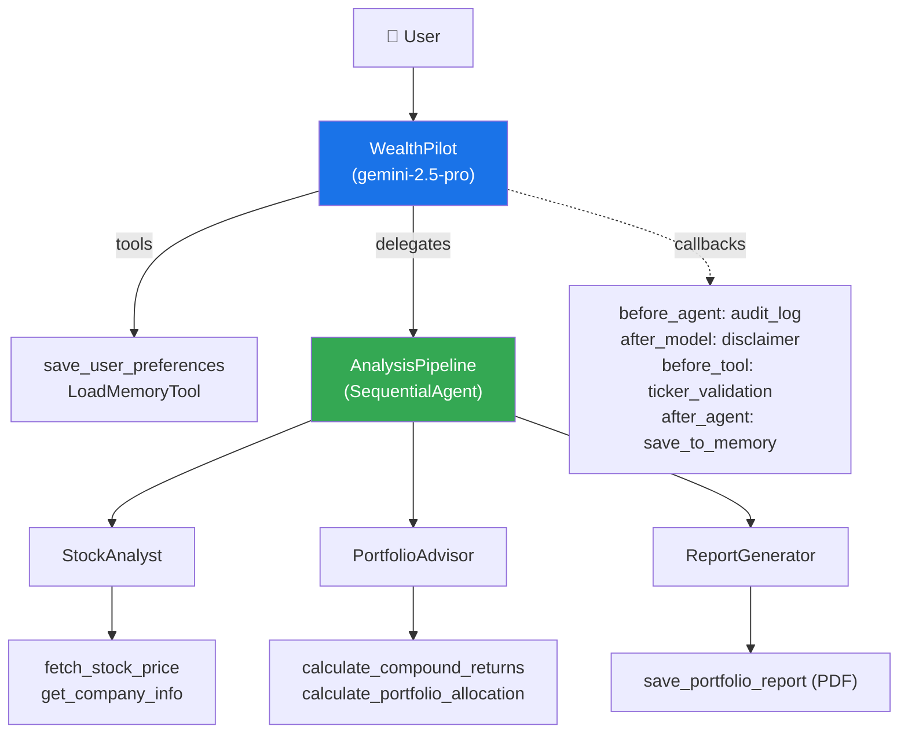

# 💰 WealthPilot — AI Wealth Advisor

A production multi-agent system built with Google ADK. WealthPilot analyzes stocks, builds portfolios, and generates downloadable PDF reports — demonstrating every major ADK feature.

## ADK Features Demonstrated

| Feature | Implementation |
|---|---|
| **Multi-agent orchestration** | Root agent delegates to `SequentialAgent` pipeline |
| **Custom tools** | `FunctionTool` with live yFinance API, financial calculators |
| **Session state** | `ToolContext.state` persists user preferences across turns |
| **Cross-session memory** | `LoadMemoryTool` + `save_to_memory` callback for recall |
| **Artifacts** | PDF report generation via `tool_context.save_artifact()` |
| **Callbacks** | Before/after agent, model, and tool guardrails |
| **Thinking** | `ThinkingConfig` for step-by-step reasoning |

## Architecture



## File Structure

```
wealth_pilot/
├── agent.py           # All agents: root, pipeline, sub-agents
├── tools/
│   ├── stock_tools.py   # yFinance API + save_user_preferences
│   ├── calc_tools.py    # Compound returns + portfolio allocation
│   └── report_tools.py  # PDF generation with fpdf2
├── callbacks/
│   └── guardrails.py    # Audit logging, disclaimer, ticker validation, memory
├── main.py              # FastAPI production server (get_fast_api_app)
├── runner_demo.py       # Programmatic Runner with all services
├── Dockerfile           # Container for Cloud Run / Docker
├── .ae_ignore           # Excludes .venv from Agent Engine staging
├── .dockerignore        # Excludes .venv from Docker builds
├── pyproject.toml       # Python dependencies (uv)
└── requirements.txt     # Pip-compatible deps (for Cloud Run)
```

## Setup

```bash
cd wealth_pilot
uv sync
cp .env.example .env
# Edit .env and add your GOOGLE_API_KEY
```

## Running

### ADK Dev UI (Browser)

```bash
# From this directory
adk web .

# From repo root
adk web wealth_pilot
```

### ADK Terminal REPL

```bash
# From this directory
adk run .

# From repo root
adk run wealth_pilot
```

### Python Runner (Programmatic)

```bash
uv run python -m wealth_pilot.runner_demo
```

Demonstrates the `Runner` class with `InMemorySessionService`, `InMemoryMemoryService`, and `InMemoryArtifactService`.

### FastAPI Server

```bash
uv run python main.py
# Server at http://localhost:8080
```

Production-ready server with custom `/download` endpoint for PDF artifacts.

### Docker

```bash
docker build -t wealth-pilot .
docker run -p 8080:8080 --env-file .env wealth-pilot
```

### Docker Compose (with UI)

```bash
# From repo root
docker compose up --build
# Backend:  http://localhost:8080
# Frontend: http://localhost:3000
```

## Deployment

See the lecture docs for detailed deployment guides:

- **Cloud Run**: [`docs/lectures/cloud_run_deployment.md`](../docs/lectures/cloud_run_deployment.md)
- **Agent Engine**: [`docs/lectures/agent_engine_deployment.md`](../docs/lectures/agent_engine_deployment.md)

### Quick Deploy to Cloud Run

```bash
adk deploy cloud_run \
  --project=$GOOGLE_CLOUD_PROJECT \
  --region=$GOOGLE_CLOUD_LOCATION \
  --service_name="wealth-pilot-service" \
  --allow_origins="*" \
  wealth_pilot \
  -- --set-secrets="GOOGLE_API_KEY=google-api-key:latest" \
     --set-env-vars="GOOGLE_GENAI_USE_VERTEXAI=0"
```

## Key Concepts

### The Pipeline Pattern
`AnalysisPipeline` is a `SequentialAgent` that runs three sub-agents in order: StockAnalyst → PortfolioAdvisor → ReportGenerator. Each agent's output feeds into the next.

### Callbacks as Guardrails
- **`before_agent`**: Audit log every invocation
- **`after_model`**: Log disclaimer warnings
- **`before_tool`**: Validate ticker symbols before API calls
- **`after_agent`**: Auto-save conversation to memory

### Session State
`save_user_preferences` writes to `tool_context.state`, making preferences (risk tolerance, budget, horizon) available to downstream agents in the same session.

### Artifacts
`save_portfolio_report` generates a branded PDF using `fpdf2` and saves it via `tool_context.save_artifact()`. The artifact is downloadable from the Dev UI or the custom frontend.
